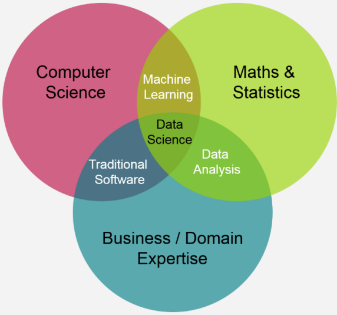

# 인공지능(AI)은
 학습하고, 적응하며, 우리가 상상하지 못한 방식으로 산업을 변화시키는 모습은 그 자체로 혁신적이다. 

오늘 이스트소프트 와썹 AI개발 양성 부트캠프의 첫날 OT를 시작하며
강사님과 멘토님의 소개를 듣고 간단한 개념 및 트렌드에 대한 설명을 들었다.

현재 나는 AI, 풀스택 개발, 데이터 분석 등 다양한 프로젝트를 진행하고 있다.
이를 통해 기술이 어떻게 실질적인 문제를 해결할 수 있는지 배우고 있으며, 앞으로도 계속 도전해 나갈 것이다.

  

> ## AI 및 데이터 관련 직군 간단 소개

>> ### 데이터 분석가 (Data Analyst)
데이터를 분석, 비즈니스 결정에 필요한 인사이트 도출.

>> ### 머신러닝 엔지니어 (Machine Learning Engineer)
머신러닝 모델을 설계, 개발, 배포하고 유지보수, 시스템에 모델 통합

>> ### 데이터 사이언티스트 (Data Scientist)
데이터 분석과 머신러닝 기술을 활용, 문제 해결. 예측 모델링과 통계 분석 수행

>> ### AI 연구원 (AI Researcher)
새로운 알고리즘, 모델을 연구 개발

>> ### 딥러닝 엔지니어 (Deep Learning Engineer)
딥러닝 모델을 전문적으로 다루며, 특히 이미지 인식, 자연어 처리 등 수행

>> ### 프롬프트 엔지니어 (Prompt Engineer)
AI가 최상의 답을 할 수 있도록 훈련 시키고 AI로부터 최상의 답을 이끌어 내는 작업을 수행행